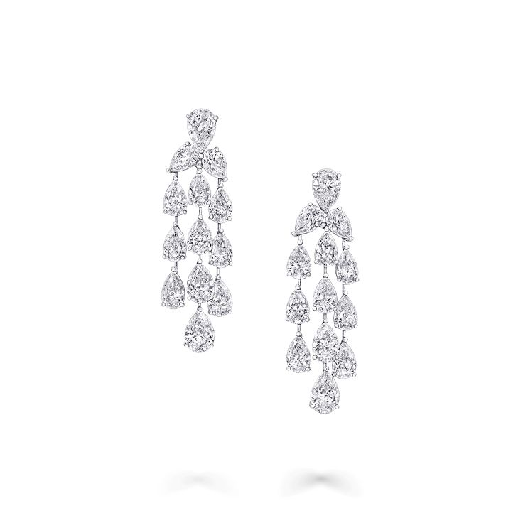
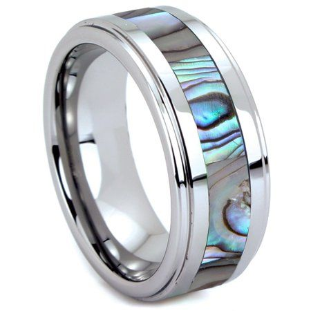
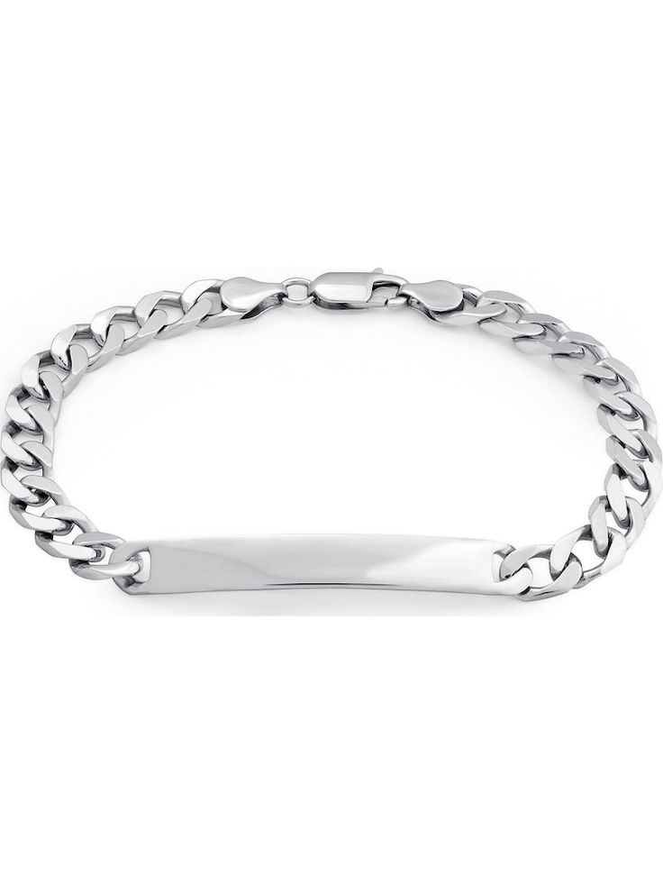
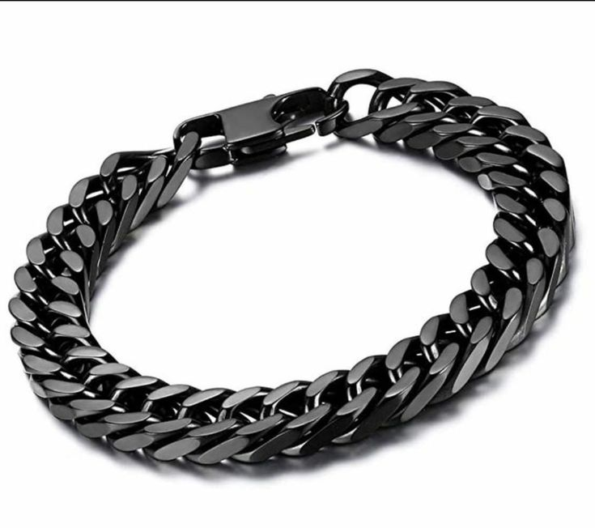
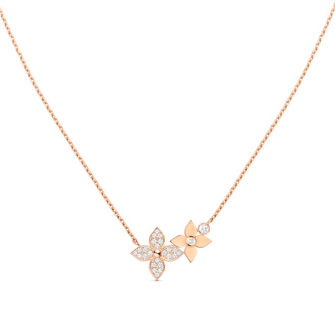

<!DOCTYPE html>
<html lang="en">
<head>
    <meta charset="UTF-8">
    <meta name="viewport" content="width=device-width, initial-scale=1.0">
    <link rel="stylesheet" href="styles.css">
</head>
<body>
    

        <h2>ZEV's Shop</h2>
        <nav>
            <ul>
                <li><a href="index.html">Home</a></li>
                <li><a href="about.html">About</a></li>
                <li><a href="http://t.me/Silly_nang">Contact</a></li>
            </ul>
        </nav>
    </header>

    <main>
        <section class="products">
            <article class="product">
                
                <h2>Product 1</h2>
                
$2.75

                <button>Purchase</button>
            </article>
            <article class="product">
                
                <h2>Product 2</h2>
                
$2.50

                <button>Purchase</button>
            </article>
            <article class="product">
                
                <h2>Product 3</h2>
                
$3.00

                <button>Purchase</button>
            </article>
            <article class="product">
                
                <h2>Product 4</h2>
                
$3.00

                <button>Purchase</button>
            </article>
            <article class="product">
                
                <h2>Product 5</h2>
                
$30.00

                <button>Purchase</button>
            </article>
        </section>
    </main>

    <footer>
        <marquee direction="right">
            <h2>&copy; 2023 ZEV's Online Accessories Shop</h2>
        </marquee>

    </footer>
</body>
</html>
